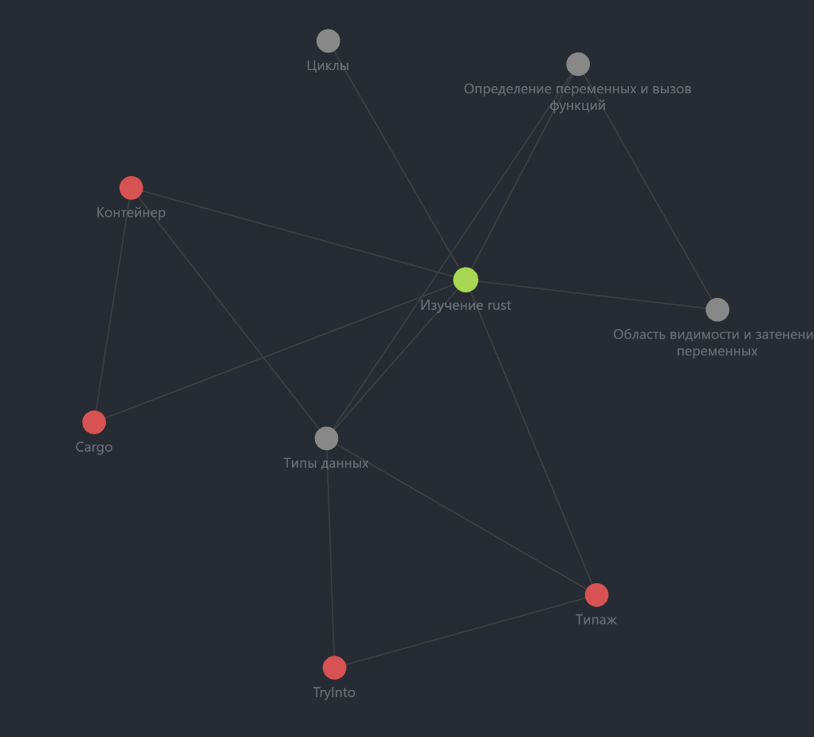

# rustynotes
Notes about Rust in Russian / Конспекты о Rust на русском.

Конспекты пишутся в Obsidian.



## Оглавление конспектов

1. [Введение](./Notes/Изучение%20rust.md)
2. [Область видимости и затенение переменных](./Notes/Область%20видимости%20и%20затенение%20переменных.md)
2. [Определение переменных и вызов функций](./Notes/Определение%20переменных%20и%20вызов%20функций.md)
3. [Типы данных](./Notes/Типы%20данных.md)
4. [Циклы](./Notes/Циклы.md)

### Дополнительная информация

+ [Контейнер](./Notes/Крейты/Контейнер.md)
+ [Типажи](./Notes/Типажи/Типаж.md)
+ [Cargo](./Notes/Cargo.md)

## Код тестов
Находится в [директории src](./src/)

### main.rs

Вывод:

```
RustyNotes Practice

# find_discriminant(1.0, -10.0, 4.0) = 84
# complex_numbers = 13.2 + 21i
# cycles and collections
Item: 0
Item: 2
Item: 4
Item: 6
Item: 8
# test floats
x is finite = false
# convert vars
(a + b) + (c + d) = 90
Ten is less than one hundred.
Ten is less than one hundred.
# test scopes
shadowed variable: 2
inner short: 2
shadowed variable: 1
outer long: 1
```
